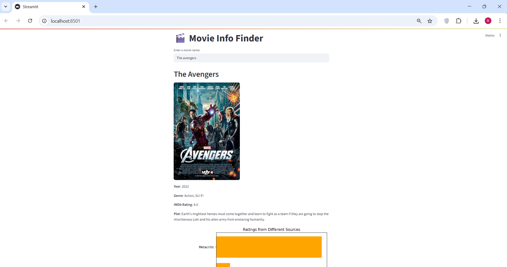

# Movie-finder-streamlit 🎬

**Movie-finder-streamlit** is a lightweight web application that allows users to search for any movie and view detailed information like title, year, genre, ratings, plot summary, and poster image.  
Built using **Streamlit**, the app integrates one external APIs:  
- **OMDb API** – for fetching movie details  


This is an ideal beginner-friendly project that demonstrates real-time **API data ingestion**, **data visualization**, and **Python web app development**.

---

## 🔧 Features

- 🔍 Movie search using keyword input
- 🎞️ View details like title, year, plot, poster, genre
- 📊 Ratings comparison (IMDb, Rotten Tomatoes, Metacritic) with bar chart visualization
- ⚙️ Built using Python, Streamlit, Requests, and Matplotlib

---

## 📸 Preview
 
> Example:  
> 

---

## 🚀 Getting Started

### Prerequisites

- Python 3.7 or above
- API keys from:
  - [OMDb API](https://www.omdbapi.com/apikey.aspx)

### Installation

1. Clone the repository:
   ```bash
   git clone https://github.com/ritik1234-del/movie-finder-streamlit
   cd reelRadar
   ```

2. Install dependencies:
   ```bash
   pip install -r requirements.txt
   ```

3. Replace API keys in `app.py`:
   ```python
   tmdb_api_key = "your_tmdb_api_key_here"
   ```

4. Run the app:
   ```bash
   streamlit run app.py
   ```

---

## 🧪 Tech Stack

| Technology     | Purpose                     |
|----------------|-----------------------------|
| Python         | Core programming language   |
| Streamlit      | Frontend web app framework  |
| OMDb API       | Fetch movie details         |
| Requests       | HTTP requests to APIs       |
| Matplotlib     | Visualization of ratings    |

---

## 📁 Project Structure

```
reelRadar/
├── app.py                # Main Streamlit application
├── requirements.txt      # Project dependencies
├── README.md             # Project documentation
└── pic1.png    # Optional: UI preview image
```

---

## 🧠 Future Enhancements

- 🎭 Show cast and crew using TMDb API
- 🧾 Show similar movies or genre-based recommendations
- 🌙 Add light/dark theme toggle

---

## 👨‍💻 Author

Developed by [Ritik Biswas](https://www.linkedin.com/in/ritikbishwas/)  
Feel free to reach out or connect!

---

## 📄 License

This project is licensed under the [MIT License](LICENSE).

